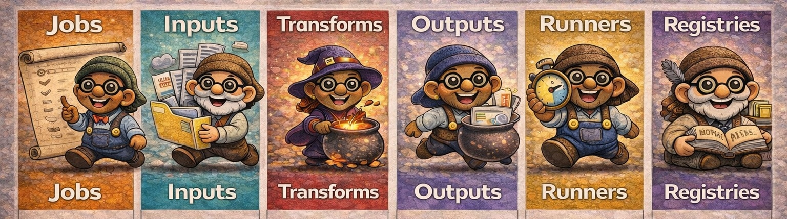

# The Family Model: Tios and Tiozins

  

The **Tiozin Family** is the architectural model behind the entire framework, and the banner above
captures it well:

- The larger characters are the **Tios and Tias**
- The smaller ones are the **Tiozins**

This metaphor defines how the system is structured, how it evolves, and how it can be extended.

## What is a Family?

A **Tio** or **Tia** is a provider Family. It represents a technological
domain with its own runtime, conventions, and set of plugins.

Examples include:

- Tio Mongo
- Tia Cassandra
- Tia Google
- Tio Flink
- Tio John

Each Family defines how it connects to data systems, which execution rules
apply, and which plugins it offers.

Families must be developed as independent projects, separate from the
Tiozin core, and must maintain their own repository, versioning strategy,
and release lifecycle. The only exception is the **Tio Kernel**, which
remains in the core as the default provider responsible for the minimal
runtime required to bootstrap the framework.

Families evolve independently from the core, preserving modularity,
replaceability, and testability without introducing a monolithic
abstraction layer.

Multiple Families together form the ecosystem, which expands as new ones
are introduced. You are free to define your own, public or private,
with whatever name you choose.

Contributions to the core are welcome where appropriate, and new provider
Families can be developed and maintained independently. If Tiozin supports
your work, you are encouraged to reference it.

## What is a Tiozin?

A **Tiozin** is a plugin offered by a Tio or Tia and the smallest
pluggable unit within the Tiozin framework. Any component participating
in the execution model is a Tiozin. Jobs, Runners, Inputs, Transforms,
Outputs, and Registries are all specialized Tiozins.

Tiozins are specific to a Family and are implemented directly on top
of the native APIs of their underlying technology. From a software design
perspective, a Tiozin acts as an Adapter: it maps a runtime-specific API
into the framework’s structural model so it can participate in declarative Jobs.

The illustration above makes this constraint explicit:

- The Spark Tiozin holds a spark → it is implemented using the Spark API
- The SQL Tiozin carries a SQL sign → it relies on SQL engines
- The DuckDB Tiozin holds a duck → it is built on DuckDB’s APIs
- The Bean Tiozin carries coffee beans → it is built on Apache Beam’s APIs

Tiozin standardizes the declarative structure of data applications but
intentionally does not define a unified execution API across runtimes.
This is by design.

Much like modern web development, where frameworks provide strong application
structure while still leveraging each platform’s native capabilities, Tiozin focuses on
developer productivity and architectural clarity rather than cross-runtime portability,
aiming to bring to data engineering the same level of structure, composability, and
developer experience that application frameworks established in web development.

By embracing the native APIs of each Family, Tiozin enables teams to build
well-structured, testable, and composable data applications without
sacrificing the power of the underlying runtime.

## The Tiozin's Pluggable Object Model

Like any well-organized family, each member has a clear responsibility.
A Tiozin Family is structured around a pluggable Object Model that defines
the core abstractions of execution. The diagram below presents the six
fundamental Tiozin roles that compose this model.

| Job | Input | Transform | Output | Runner | Registry |
|:---:|:-----:|:---------:|:------:|:------:|:--------:|
| Defines a pipeline as a declarative execution graph by composing Inputs, Transforms, Outputs, and a Runner. | Declares how data enters the pipeline. | Defines how data is modified within the pipeline. | Declares where processed data is written. | Provides the runtime engine responsible for executing a Job. | Provides metadata services required to define, execute, and govern data processes. |

Each Tiozin role represents a single, well-defined responsibility within
the execution pipeline. Tiozins are designed to be small, specialized,
composable, and testable. Complex data processes are constructed by
composing these focused units into declarative Jobs.

This Object Model establishes the structural foundation that makes
Tiozin declarative, pluggable, metadata-native, observable, and testable.

## Summary

- **Family** is a plugin provider
- **Tio** is a provider package
- **Tiozin** is a plugin
- **Job** is a Tiozin that implements a pipeline DAG
- **Runner** is a Tiozin that implements an execution engine
- **Input** is a Tiozin that implements a data source
- **Transform** is a Tiozin that implements data modification logic
- **Output** is a Tiozin that implements a data destination
- **Registry** is a Tiozin that implements a metadata service
