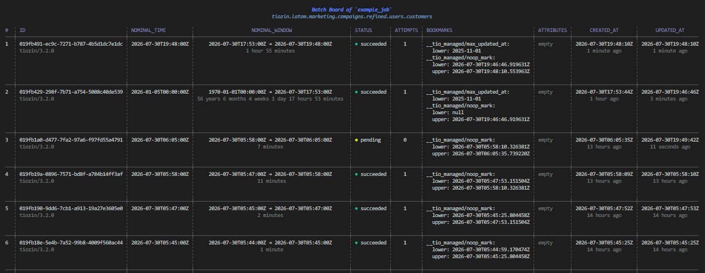

# How to Work with Incremental Backlogs

This guide shows how to build and operate incremental jobs.

You'll learn how to:

- process only new data instead of reading everything every run;
- pass batches between jobs;
- inspect pending batches;
- replay, cancel, quarantine, and register batches.

If you're new to batches, read [Batches](../concepts/batches.md) first.

Reading time: about 5 minutes.

## 1. Making a Job Incremental

Enable incremental processing by setting the backlog policy:

```yaml
name: order_ingestion_job
cadence: daily
backlog_policy: incremental
```

Each execution creates or updates the current batch before the pipeline starts.

## 2. Reading New Data

Most sources expose an ordered field, such as: `updated_at`, `created_at`, `id`, etc. Tiozin can manage these values automatically.

```python
from tiozin import Input
from tiozin.utils import epoch


class OrdersInput(Input[list]):
    def read(self):
        source = OrdersApi()

        start = self.context.get_job_managed_bookmark("max_updated_at", epoch())
        end = self.context.set_job_managed_bookmark(
            "max_updated_at",
            source.max_updated_at(),
        )

        return source.read(start, end)
```

The first batch has no lower bound. Reading starts from the fallback, the Unix epoch (`1970-01-01T00:00:00Z`).

| Method | Purpose |
|---------|---------|
| `get_job_managed_bookmark()` | Returns where the current batch starts reading. |
| `set_job_managed_bookmark()` | Freezes where the current batch stops reading. |

Replaying a batch reads the same range again because the upper bound is stored with the batch.

Use managed bookmarks whenever the source can be filtered by an ordered column.

## 3. Simple Bookmarks

Simple key-value pairs that can be set directly by a plugin, without any intervention or window management by Tiozin.

```yaml
bookmarks:
  last_offset: 250
```

Unlike managed bookmarks, simple bookmarks do not ensure deterministic replays. By opting out of Tiozin's managed window mechanism, the plugin implementation is responsible for accepting the loss of idempotency or implementing its own mechanism to preserve it.


```python
class OrdersInput(Input[list]):
    def read(self):
        source = OrdersApi()

        offset = self.context.get_job_bookmark("last_offset", 0)
        page = source.read(last_offset=offset)

        self.context.set_job_bookmark(
            "offset",
            offset + len(page),
        )

        return page
```

## 4. Passing Work to Another Job

A downstream job consumes batches produced by another job.

Configure the consumer:

```yaml
backlog_policy: consumer
max_batches_per_run: 10
```

The producer registers a [`Batch`](../concepts/batches.md#batch-members) for the downstream job:

```python
from tiozin import Batch, Output


class OrdersOutput(Output[list]):
    def __init__(self, path: str, **options):
        super().__init__(**options)
        self.path = path

    def write(self, data):
        OrdersLake(self.path).save(data)

        Batch(
            org="tiozin",
            region="eu",
            domain="ecommerce",
            subdomain="sales",
            layer="refined",
            product="storefront",
            model="orders",
            nominal_time=self.context.nominal_time,
            attributes={"path": self.path},
        ).register()

        return data
```

The resource fields are the consumer's, because a job only sees batches registered under its own resource.

The consumer reads those attributes:

```python
from tiozin import Input


class RefinedOrdersInput(Input[list]):
    def read(self):
        rows = []

        for batch in self.context.get_job_backlog():
            rows += OrdersLake(batch.attributes["path"]).load()

        return rows
```

## 5. Inspecting the Backlog

The most useful commands are:

```bash
# Pending batches
tiozin batch backlog <JOB>

# Current frontier
tiozin batch frontier <JOB>

# Batch history
tiozin batch board <JOB>
```
Each command prints the batch ID used by the management commands below. Example:
```
tiozin batch board examples/jobs/dummy.yaml
```


## 6. Batch States

Most issues can be diagnosed from the batch status.

| Status | Meaning |
|---------|---------|
| `PENDING` | Waiting to run. |
| `RUNNING` | Currently executing. If interrupted, it is retried automatically. |
| `FAILED` | Failed and will be retried until the retry limit is reached. |
| `QUARANTINED` | Removed from the backlog until replayed. |
| `CANCELED` | Permanently skipped. |
| `SUCCEEDED` | Completed successfully. |

## 7. Managing Batches

Use the following commands to manage batches.

| Command | Description |
|---------|-------------|
| `replay` | Returns a batch to pending so the next run processes it. |
| `quarantine` | Removes a batch from the backlog until replayed. |
| `cancel` | Marks a batch as canceled. |
| `register` | Creates a new pending batch. |

```bash
tiozin batch replay JOB <batch-id>
tiozin batch quarantine JOB <batch-id>
tiozin batch cancel JOB <batch-id>
tiozin batch register JOB 2026-01-05T00:00:00Z
```

## 8. Updating Batch Properties

The `register`, `cancel`, `replay`, and `quarantine` commands accept additional **attributes** and **bookmarks**.

| Option | Long form | Updates |
|--------|-----------|---------|
| `-a key=value` | `--attribute key=value` | Batch attributes |
| `-b key=value` | `--bookmark key=value` | Batch bookmarks |

For example:

```bash
tiozin batch replay JOB <batch-id> \
  --attribute source.file=orders.parquet \
  --bookmark source.offset=0
```

Keys support dot notation:

```bash
--attribute source.file=orders.parquet
```

becomes:

```yaml
attributes:
  source:
    file: orders.parquet
```

Values can be strings, numbers, booleans, dates, or lists.

Managed bookmarks are stored under `__tio_managed/`.

For example, replay a batch from an earlier point:

```bash
tiozin batch replay JOB <batch-id> \
  --bookmark "__tio_managed/max_updated_at.lower=2025-12-01"
```

Or register a batch for a fixed range:

```bash
tiozin batch register JOB 2026-01-05T00:00:00Z \
  --bookmark "__tio_managed/max_updated_at.lower=2025-12-01" \
  --bookmark "__tio_managed/max_updated_at.upper=2026-01-01"
```

## Next Steps

- [Batches](../concepts/batches.md)
- [Jobs](../concepts/jobs.md#max-batches-per-run)
- [IcebergBatchRegistry](../tio_kernel/iceberg-batch-registry.md)
- [Working with Jobs](../working-with-jobs.md)
